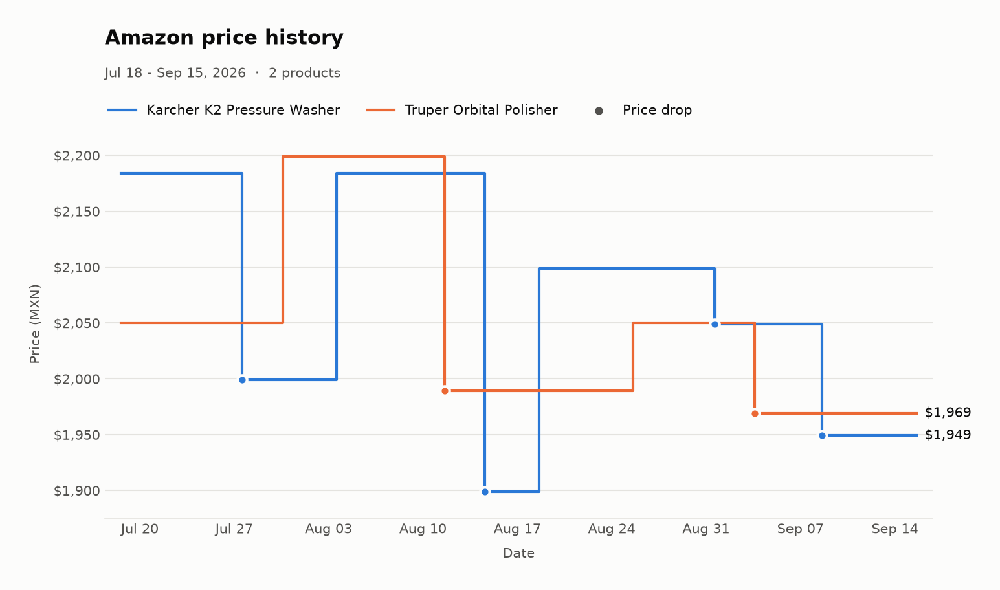
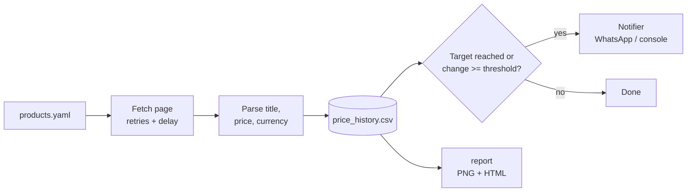

# Amazon Price Tracker

Watch Amazon product prices, keep a price history, and get a WhatsApp message when something gets cheaper.



*Chart generated by `python -m price_tracker report` from [sample data](data/sample_history.csv) (fictional prices for illustration).*

[](https://github.com/ecarriedo19/amazon-price-tracker/actions/workflows/ci.yml)


## What it does

You list the Amazon products you care about in a YAML file. Each time the tracker runs, it opens each product page, reads the current price, and saves it to a CSV file. If the price drops to your target, or moves by more than a set percentage since last time, it sends you an alert on WhatsApp (or prints it to the terminal). A `report` command turns the saved history into a chart like the one above.

## Features

- **Simple config**: products, target prices and alert thresholds in `products.yaml`. Messy share links are cleaned down to `amazon.com.mx/dp/<ASIN>`.
- **Robust parsing**: several price selectors with fallbacks, handles `MX$1,899.00`, `$24.99`, `1.899,00` and split whole/fraction price markup.
- **Polite fetching**: retries with exponential backoff, a random delay between products, and a clear error when Amazon serves a captcha page.
- **Price history**: append-only CSV (timestamp, ASIN, title, price, currency).
- **Smart alerts**: only when the price reaches your target or changes by at least N%. English or Spanish messages.
- **Pluggable notifiers**: WhatsApp via Twilio, or the console.
- **Works offline**: `--demo` reads saved HTML pages, so a fresh clone runs end to end without touching Amazon.
- **Reports**: PNG chart plus an optional static HTML summary.
- **Tested**: pytest suite with saved HTML fixtures; ruff + pytest in CI.

## How it works



1. **Config** (`config.py`) loads and validates `products.yaml`.
2. **Scraper** (`scraper.py`) downloads each page, or loads a saved page in demo mode.
3. **Parser** (`parsing.py`) pulls out the title, price and currency, and detects captcha pages.
4. **Storage** (`storage.py`) appends the reading to the CSV and returns the previous price.
5. **Alerts** (`alerts.py`) compares old and new prices and words the message.
6. **Notifiers** (`notifiers.py`) deliver it.

## Quick start

Requires Python 3.11+.

```bash
git clone https://github.com/ecarriedo19/amazon-price-tracker.git
cd amazon-price-tracker
python -m venv .venv
source .venv/bin/activate        # Windows: .venv\Scripts\activate
pip install -e ".[dev]"
```

**1. Offline demo** (no network, no accounts):

```bash
python -m price_tracker --demo
```

This starts from the sample history, reads the saved pages in `price_tracker/demo_pages/`, and prints two alerts:

```text
Price Tracker: Target price reached
Kärcher Hidrolavadora Eléctrica K2 Compact
Was: $1,949.00 MXN
Now: $1,749.00 MXN
Change: -10.3%
Link: https://www.amazon.com.mx/dp/B0CM49Z6SN
```

**2. Real prices, alerts printed instead of sent:**

```bash
python -m price_tracker --dry-run
```

**3. Real run with WhatsApp alerts** (see [Alerts setup](#alerts-setup)):

```bash
pip install -e ".[whatsapp]"
python -m price_tracker
```

**4. Chart and HTML report:**

```bash
python -m price_tracker report --html docs/report.html
```

Uses `data/price_history.csv` if you have one, otherwise the sample data. Pass `--history` and `--output` to choose files.

## Configuration

`products.yaml`:

```yaml
settings:
  threshold_pct: 5        # default % change that triggers an alert
  locale: en              # alert language: en or es
  delay_seconds: [3, 8]   # random pause between products

products:
  - name: Karcher K2 Pressure Washer
    url: https://www.amazon.com.mx/dp/B0CM49Z6SN
    target_price: 1800    # alert once when price <= 1800

  - name: Truper Orbital Polisher
    url: https://www.amazon.com.mx/dp/B0BNW5RQN6
    threshold_pct: 3      # per-product override
```

| Field | Required | Meaning |
| --- | --- | --- |
| `name` | yes | Label used in logs, alerts and charts |
| `url` | yes | Any Amazon product URL; normalized to `/dp/<ASIN>` |
| `target_price` | no | Alert when the price first falls to or below this |
| `threshold_pct` | no | Alert when the price moves at least this % (default from `settings`) |

Alert rules: a **target** alert fires once when the price crosses under the target (not on every run while it stays there). A **threshold** alert fires on any move, up or down, of at least `threshold_pct` percent compared with the last saved price.

Environment variables (only for WhatsApp alerts, see `.env.example`):

| Variable | Meaning |
| --- | --- |
| `TWILIO_ACCOUNT_SID` | Twilio account SID |
| `TWILIO_AUTH_TOKEN` | Twilio auth token |
| `TWILIO_WHATSAPP_FROM` | Twilio WhatsApp sender number, e.g. `+14155238886` |
| `WHATSAPP_TO` | Your WhatsApp number in international format |

## Alerts setup

1. Create a free [Twilio](https://www.twilio.com/) account.
2. In the console, open **Messaging > Try it out > Send a WhatsApp message** and join the sandbox from your phone.
3. Set the four environment variables above (for example `export TWILIO_ACCOUNT_SID=...`), or add them as repository secrets for GitHub Actions.
4. Test with `python -m price_tracker --dry-run` first, then run without it.

## Running on GitHub Actions

`.github/workflows/price-check.yml` runs a price check **only when you trigger it manually** (no schedule):

1. Add the four Twilio variables under **Settings > Secrets and variables > Actions**.
2. Go to **Actions > Price check > Run workflow**. Leave "dry run" checked to print alerts instead of sending them.
3. Price history is kept between runs with the Actions cache, and each run uploads the chart and HTML report as a downloadable artifact.

`.github/workflows/ci.yml` runs ruff and pytest on every push and pull request.

## Project structure

```text
amazon-price-tracker/
├── price_tracker/
│   ├── __main__.py          # python -m price_tracker
│   ├── cli.py               # check / report commands, --demo, --dry-run
│   ├── config.py            # products.yaml loading, URL normalization
│   ├── scraper.py           # HTTP fetch with retries, demo page loader
│   ├── parsing.py           # title/price/currency extraction, captcha detection
│   ├── storage.py           # append-only CSV history
│   ├── alerts.py            # alert rules and message text
│   ├── notifiers.py         # console and Twilio WhatsApp notifiers
│   ├── tracker.py           # one run: fetch -> store -> alert
│   ├── report.py            # matplotlib chart and HTML report
│   └── demo_pages/          # saved product pages for --demo
├── scripts/
│   └── generate_sample_history.py
├── tests/                   # pytest suite + HTML fixtures
├── data/sample_history.csv  # fictional 60-day sample history
├── docs/                    # generated chart and report
├── products.yaml
├── pyproject.toml
└── .github/workflows/       # ci.yml, price-check.yml (manual)
```

## Tests

```bash
pytest          # parsing, alert rules, storage, config, retries, CLI end to end
ruff check .    # lint
```

The tests never hit the network: parsing is checked against small saved HTML pages in `tests/fixtures/`.

To regenerate the sample data and chart:

```bash
python scripts/generate_sample_history.py
python -m price_tracker report --history data/sample_history.csv --html docs/report.html
```

## Limitations

- **Amazon changes its HTML.** The parser tries several known layouts, but a redesign can break it. When that happens you'll see `No price found` in the logs; update `PRICE_SELECTORS` in `parsing.py` and add a fixture test.
- **Bot detection.** Amazon may answer with a captcha page, especially from cloud IPs like GitHub Actions. The tracker reports this clearly and moves on; it deliberately does not try to get around it. Running a few times a day from a home connection works best.
- **Terms of service.** Automated scraping may be against Amazon's Conditions of Use. This project is for personal, low-volume use and learning. For anything beyond that, use the official [Product Advertising API](https://webservices.amazon.com/paapi5/documentation/).
- Prices are read as shown to a logged-out visitor; they can differ by location, seller, or Prime status.

## License

[MIT](LICENSE) © 2026 Ethan Carriedo
